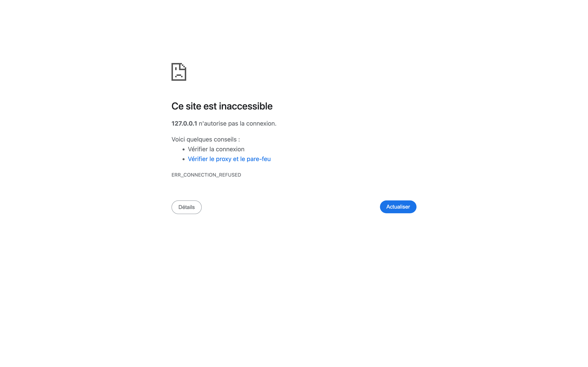

# ⚡ OCX Manager

Gérez **plusieurs providers** dans Codex via le proxy [opencodex](https://github.com/lidge-jun/opencodex) — là où Codex seul n'autorise qu'un seul provider à la fois.

> Projet officiel : **[lidge-jun/opencodex](https://github.com/lidge-jun/opencodex)** · paquet npm : [`@bitkyc08/opencodex`](https://www.npmjs.com/package/@bitkyc08/opencodex)

## Aperçu



## Fonctionnalités

- **Tableau de bord web** (`http://localhost:10105`) : liste numérotée des providers, ajout depuis 64 presets (OpenRouter, Groq, Anthropic, Gemini, Ollama…), test, édition, activation/désactivation, suppression, provider par défaut.
- **Bascule du modèle actif en un clic** : met à jour le provider par défaut d'opencodex + la ligne `model =` de `~/.codex/config.toml` (avec backup automatique) + resynchronise le catalogue Codex.
- **Visibilité des modèles** : cases à cocher par modèle, « Tout afficher » / « Tout cacher », compteur de modèles masqués.
- **App macOS « OCX Switcher »** (barre des menus, Swift/AppKit) : icône ⚡, switch provider/modèle, ajout de provider avec clé API, gestion des modèles visibles.
- **App Windows & Linux « OCX Switcher »** (plateau système, Electron) : mêmes fonctions que l'app macOS, fenêtres d'ajout de provider et de gestion des modèles, copier-coller natif (Ctrl+V).

## Architecture

```
opencodex (proxy, port 10100)
   └── OCX Manager (serveur local Node, port 10105)
         ├── interface web  (public/)
         ├── app macOS      (macos/OCXSwitcher, Swift)
         └── app Win/Linux  (desktop/, Electron)
```

Le serveur OCX Manager relève le token admin depuis `~/.opencodex/admin-api-token` et ne l'expose jamais aux interfaces. Les clés API saisies sont stockées dans la configuration locale d'opencodex.

## Démarrage rapide

Prérequis : [Node.js 18+](https://nodejs.org), opencodex installé et démarré (`ocx start`, port 10100 par défaut).

```bash
cd ocx-manager
node server.mjs
```

Puis ouvrez http://localhost:10105/.

Variables d'environnement : `APP_PORT` (défaut 10105), `OCX_PORT` (défaut 10100).

## Apps de plateau système (Windows / Linux / macOS)

### Windows & Linux (Electron)

```bash
cd ocx-manager/desktop
npm install
npm start            # mode développement
npm run dist:win     # build Windows (NSIS + zip)
npm run dist:linux   # build Linux (AppImage + deb)
```

Les binaires sont également construits automatiquement par GitHub Actions (workflow `.github/workflows/build.yml`) à chaque push sur `main` ; un tag `v*` crée une release avec les installeurs.

### macOS (Swift)

```bash
cd ocx-manager/macos
bash build-app.sh    # produit OCXSwitcher.app
open OCXSwitcher.app
```

## Sécurité

- Le token admin d'opencodex est lu côté serveur (`~/.opencodex/admin-api-token`), jamais envoyé au navigateur ni aux apps.
- Les clés API des providers restent dans la config locale d'opencodex (`~/.opencodex/config.json`).

## Structure du projet

```
ocx-manager/
├── server.mjs            # relais local + switch de modèle
├── public/               # interface web
├── macos/                # app Swift (barre des menus)
└── desktop/              # app Electron (Windows & Linux)
```

## Licence

MIT — à l'image de [opencodex](https://github.com/lidge-jun/opencodex).
